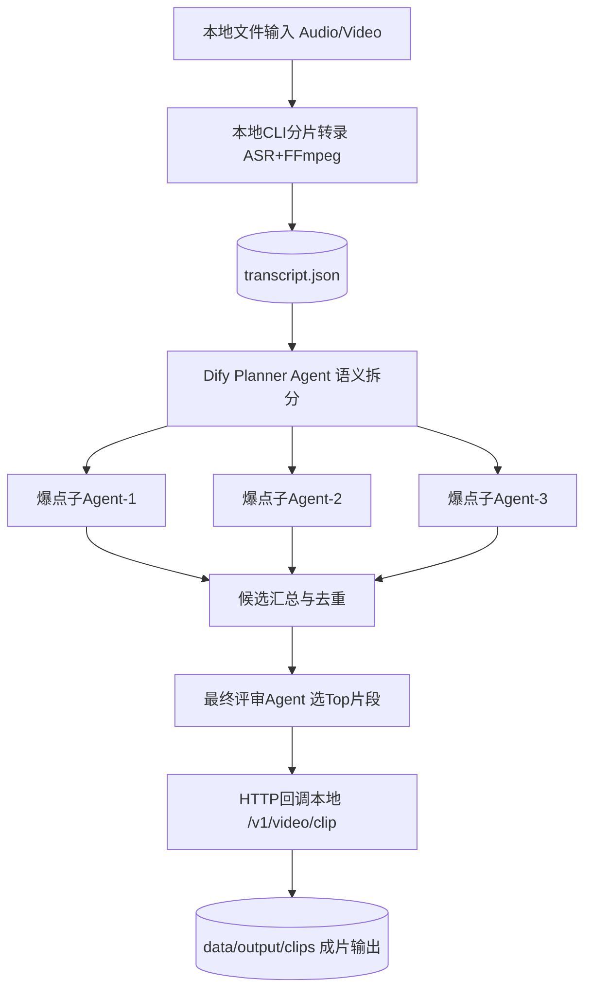

---

# AI 播客生产 Agent｜内容生产效率产品 PRD

## 一、项目背景

随着播客和长音频内容创作持续增长，创作者在内容生产链路中的效率问题逐渐突出。单期播客通常时长在 30–90 分钟之间，从录制完成到正式上线，往往需要经历人工回听、章节整理、精彩片段识别、标题摘要撰写、封面文案生成以及多平台重复上传等多个步骤。对于个人主播和小型内容团队而言，这一流程高度依赖人工经验，单期制作耗时通常在 3–6 小时，严重限制内容更新频率与规模化生产能力。因此，本项目围绕播客生产全链路，设计一套基于多 Agent 协作的内容生产效率产品，通过“本地长音频理解（分片转录）→ Dify 多 Agent 内容分析 → 智能剪辑执行”的方式，将原本割裂的工作流整合为一体化 Agent 产品。

---

## 二、用户问题定义

核心目标用户为中小播客主播、MCN 内容团队以及企业品牌内容运营团队。经过对真实播客生产链路的拆解，可以发现用户问题主要集中在三个层面。首先，在内容理解阶段，主播需要花费大量时间重新回听整期节目，手动记录章节和高价值观点，效率极低且容易遗漏关键内容；其次，在剪辑和包装阶段，精彩片段的识别高度依赖个人经验，标题、摘要、封面文案和社交平台传播文案均属于高频重复劳动；最后，在发布阶段，不同平台之间缺乏统一工作台，需要重复上传音频、填写信息、配置发布时间，协作链路冗长且缺少效果回流。整体来看，用户的核心诉求并非单点能力优化，而是希望获得一套覆盖理解、剪辑建议和发布分发的全流程自动化解决方案。

---

## 三、产品方案设计

针对上述问题，产品整体设计为一个“本地处理 + Dify 编排”的多 Agent 协作工作流。用户先在本地通过 CLI 指定音频/视频文件，系统执行分片转录并产出 `transcript.json`（含 `text/segments/duration/source_file`）。随后将转录结果输入 Dify，由任务拆分 Planner 将全文语义拆成三段，三个爆点子 Agent 并行提取候选片段，再由最终评审 Agent 从候选中选出高价值片段。最后，Dify 通过 HTTP 回调本地 `/v1/video/clip`，按 `start/end` 自动裁剪出短视频文件，实现从转录到剪辑输出的闭环。

---

## 四、多 Agent 协作机制

在 Agent 角色设计上，当前实现由四类角色组成。Planner Agent 负责基于全文转录做语义切分规划；三个爆点子 Agent 分别只接收各自分段文本，独立输出候选片段；最终评审 Agent 负责候选去重后的价值评估与 TopN 选择。ASR 与媒体处理不放在 Dify 内执行，而由本地 Go + ffmpeg 承担，Dify 专注语义理解与编排。各节点以结构化 JSON 交互，确保输入边界清晰、子 Agent 任务隔离、结果可追踪和可复用。

---

## 五、核心指标设计

产品效果主要围绕效率提升和内容质量两个方向进行评估。在效率层面，重点关注单期播客从上传到发布的总耗时、用户人工操作步数以及多平台发布成功率，目标是将原本 4 小时以上的生产流程压缩至 30 分钟以内。在内容质量层面，重点衡量 AI 推荐片段的采纳率、标题点击率、平台播放完成率以及社交平台二次传播率，以验证 Agent 对内容价值提升的实际贡献。此外，在模型和 Agent 效果层，还需要跟踪爆点识别准确率、标题生成满意度以及自动发布异常率，为后续 Prompt 优化和流程策略迭代提供依据。

---

## 六、落地与 Demo 验证

在 Demo 验证阶段，方案采用“本地执行引擎 + Dify 工作流”进行落地。整体路径为：本地 CLI 分片转录（Whisper 兼容 ASR）→ 产出 `transcript.json` → Dify 多 Agent 生成爆点片段 → HTTP 回调本地剪辑服务执行 FFmpeg 裁剪。该 Demo 的核心目标是验证 60 分钟级长音频可稳定处理、并行子 Agent 可输出可剪辑的时间戳结果、以及本地剪辑接口可端到端产出成片文件。

---

## 七、项目价值

该项目的核心价值在于将原本高度依赖人工经验的播客生产流程升级为标准化 Agent 工作流，使内容创作者从“手工生产内容”转向“管理内容生产流程”。除个人主播场景外，该方案还可进一步延展至企业知识播客自动生产、品牌内容中台、MCN 内容流水线以及飞书知识沉淀场景，具备明显的 B 端和 C 端双向扩展能力

---

## 八、数据工作流程（Data Workflow）

